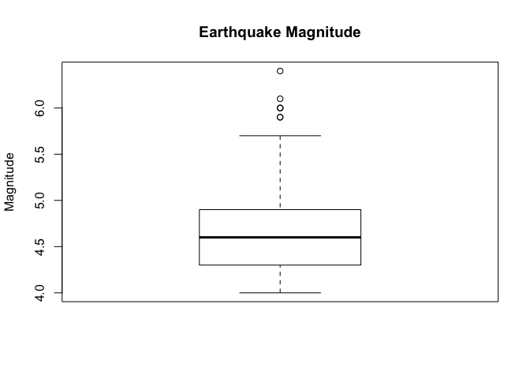
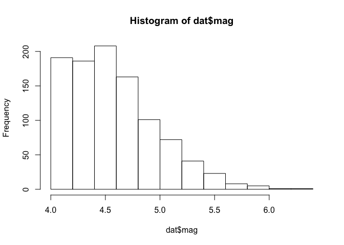
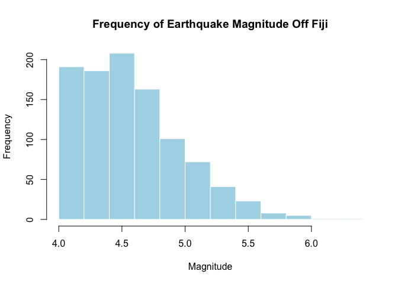

Fiji Earthquake Data
================

### Choose and load desired dataset

Explore preloaded R datasets

``` r
data()
```

Select Fiji Earthquakes data

``` r
#load Fiji earthquake data
data(quakes)

#give quakes a shorter, general name (so code chunks can be re-used)
dat <-quakes
```

### Initial data exploration

Quickly summarize each variable

``` r
summary(dat)
```

    ##       lat              long           depth            mag      
    ##  Min.   :-38.59   Min.   :165.7   Min.   : 40.0   Min.   :4.00  
    ##  1st Qu.:-23.47   1st Qu.:179.6   1st Qu.: 99.0   1st Qu.:4.30  
    ##  Median :-20.30   Median :181.4   Median :247.0   Median :4.60  
    ##  Mean   :-20.64   Mean   :179.5   Mean   :311.4   Mean   :4.62  
    ##  3rd Qu.:-17.64   3rd Qu.:183.2   3rd Qu.:543.0   3rd Qu.:4.90  
    ##  Max.   :-10.72   Max.   :188.1   Max.   :680.0   Max.   :6.40  
    ##     stations     
    ##  Min.   : 10.00  
    ##  1st Qu.: 18.00  
    ##  Median : 27.00  
    ##  Mean   : 33.42  
    ##  3rd Qu.: 42.00  
    ##  Max.   :132.00

### Visualization

###### Often, a visual analysis is more helpful than raw data alone.

Visualize earthquake magnitude with a boxplot. This is the same values as the summary table above, but represented visually.



A histogram shows the frequency of a given variable. In this case, earthquake magnitude. 

Graphs are even more helpful when they're visually appealing and well labelled! 
